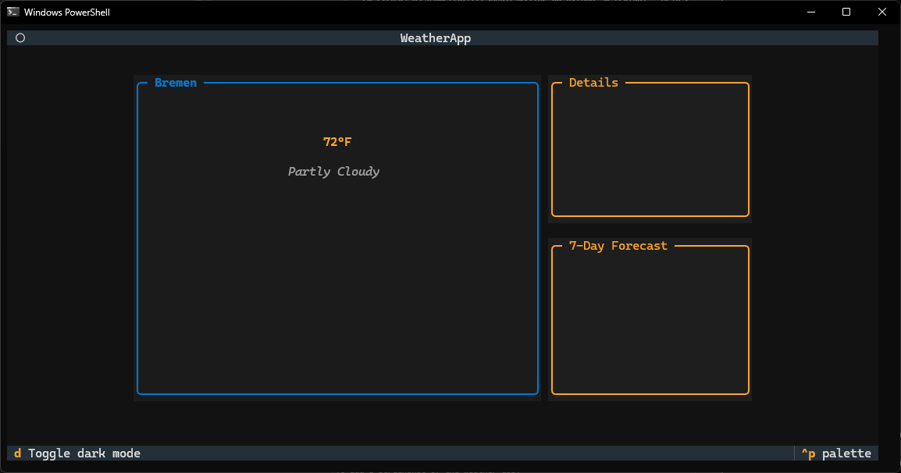

# skyline
A weather TUI built while learning terminal UIs — because they just look incredibly cool

## Preview



*Enter your location to see weather information displayed in a sleek terminal interface*

## Features

- Clean terminal UI with location input
- Two-panel weather display with current conditions
- Dark mode toggle (press `d`)
- Placeholder sections for detailed weather metrics and 7-day forecast

## Running the App

```bash
python -m skyline.app
```

## Project Structure

```
skyline/
├── app.py          # Main application entry point
├── style.tcss      # Textual CSS styling
└── widgets/
    ├── location.py # Location input widget
    └── weather.py  # Weather display widget
```
